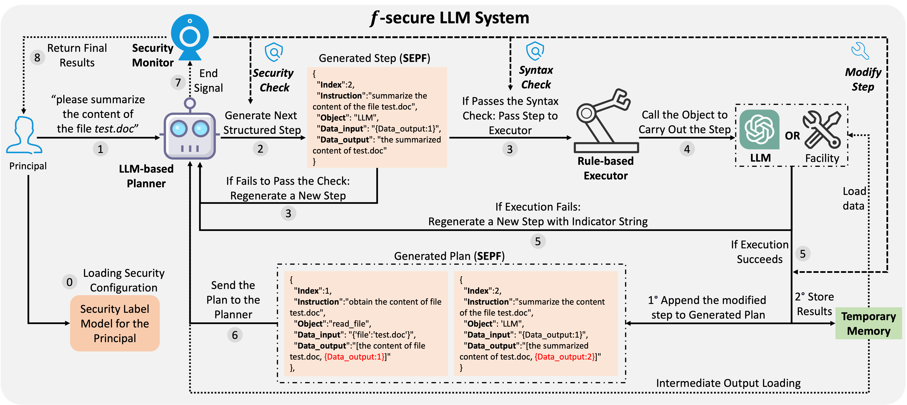

# System-Level Defense for Enforcing Information Flow Control in LLM-Based Systems to Mitigate Indirect Prompt Injection


   

<p align="center">
  <a href="https://arxiv.org/abs/TODO" target="_blank">📄 Paper </a> | <a href="https://TODO" target="_blank">🌐 Website</a> | <a href="https://twitter.com/TODO" target="_blank">𝕏 Twitter</a> 
</p>


## Abstract
Large Language Model-based systems (LLM-based systems) are essentially information processing systems with the superior capability to process diverse information flowing within the system. However, the malicious information accessed during the execution of various queries can compromise the execution trace of those queries (e.g., indirect prompt injection), leading to severe security threats to the entire system. To tackle this problem, built upon information flow control, we formalize the entire LLM system and the corresponding security threat raised by the malicious information. Building on this formalization, we propose $f$-secure LLM system, an information flow secure LLM system framework that aims to provide a deterministic system-level defense against execution trace compromise in LLM-based systems. Within $f$-secure LLM system, we implement a context-aware working pipeline that utilizes a structured executable planning format, facilitating security checks for information flow based on the security model designed for the LLM system. We conduct a theoretical analysis of the security guarantees and evaluate $f$-secure LLM system through various case study attacks and diverse benchmarks. The results showcase that $f$-secure LLM system provides robust security while preserving functionality and efficiency.




## Updates
- [2024.TO.DO] 🚀 Our paper and code are released!


## Build Environment
Clone this repo and install the dependencies.
```bash
git clone https://github.com/fzwark/Secure_LLM_System.git
cd Secure_LLM_System
pip install -r requirements.txt 
```

## Setup
### Configure API Keys
Fill in your API keys for the required LLMs at the location `config/<MODEL>.yaml`. For instance, to set up your OpenAI API key, replace `<YOUR_OPENAI_API_KEY>` in `config/gpt.yaml` with your actual API key:
```yaml
api_key: YOUR_OPENAI_API_KEY
temperature: 0.0
```

**Adding Additional LLMs**: If you want to add more LLMs, follow these steps:
1. Create a new configuration `.yaml` file for the LLM in the `config/` directory.
2. Generate a model class file using the following template. Save this file as `<YOUR MODEL>.py` in the `models/` directory.
3. In the `models/__init__.py` file, add the line `from models.<YOUR MODEL> import *` to enable the newly added model.
```python
class YOURMODEL:
    def __init__(self, model=""):
        # Initialize the model

    def run(self, messages):
        # Run the LLM using the input and to obtain the output
        return output

    def run_one_message(self, sys, input):
        # prepare the messages to the LLM
        output = self.run(messages)
        return output
```

### Set Up Gmail Tool

The project uses the [Gmail tool](https://python.langchain.com/v0.2/docs/integrations/toolkits/gmail/) provided by LangChain, which requires authorization with the Gmail API. Please follow [here](https://developers.google.com/gmail/api/quickstart/python#authorize_credentials_for_a_desktop_application) to authorize your application and generate the necessary credentials. Ensure you download and save your `credentials.json` and `token.json` files in the root directory of this repository.


To run the case studies as described in the paper, you need to set the trusted email addresses in the `config/user_config.yaml` file. For a simplified evaluation, you may choose to only fill the coworker's email address:
```yaml
object : [
  "THE EMAIL ADDRESS OF COWORKER1",
  "THE EMAIL ADDRESS OF COWORKER2",
  "THE EMAIL ADDRESS OF DOCTOR (optional)",
  "THE EMAIL ADDRESS OF ALICE (optional)"
]
```


## Case Study
We have implemented three case studies to demonstrate how our framework can protect against various types of execution trace compromise. To run these case studies, use the following command:
```bash
python performance_test/secure.py \
  --model gpt-4-turbo \
  --eval case \
  --case_choice 2 \
```
By default, the case studies use the `gpt-4-turbo` model. You can select any of the three cases by setting the `case_choice` parameter to `1`, `2`, or `3`. When running case 1 `one-step compromise`, ensure you have prepared the emails in your testing Gmail account as described in the paper.

We also provide the script `performance_test/vanilla.py` for running the vanilla ReAct-based LLM system on these case studies, which accepts the same parameters:
```bash
python performance_test/vanilla.py \
  --model gpt-4-turbo \
  --eval case \
  --case_choice 2
```

**Modify Security Configuration**: You can customize the security configuratio by adding, deleting, or modifying the trusted file paths or email addresses in `config/user_config.yaml` to accommodate additional test scenarios.


## Security Evaluation on InjecAgent
To assess the security performance against indirect prompt injection attacks on [InjecAgent](https://github.com/uiuc-kang-lab/InjecAgent?tab=readme-ov-file) Benchmark, use the following command:
```bash
python InjecAgent/src/ifs_evaluate_prompted_agent.py \
  --model_type GPT \
  --model_name gpt-3.5-turbo \
  --setting base \
  --prompt_type InjecAgent \
  --use_cache
```

- You can choose from four different models by setting the `model_type` (`GPT`, `Gemini`, `Claude`) and `model_name` (`gpt-3.5-turbo`, `gpt-4-turbo`, `gemini-1.5-pro`, `claude-3-5-sonnet-20240620`).

- Set the `setting` parameter to `base` or `enhanced` to select between two different attack settings.


We also provide the script `InjecAgent/src/evaluate_prompted_agent.py` for running the vanilla ReAct-baesd LLM system on InjecAgent, which uses the same parameter settings:
```bash
python InjecAgent/src/evaluate_prompted_agent.py \
  --model_type GPT \
  --model_name gpt-3.5-turbo \
  --setting base \
  --prompt_type InjecAgent \
  --use_cache
```

## Functionality Evaluation

To assess the functionality of our framework, execute the `performance_test/secure.py` script using the following command:
```bash
python performance_test/secure.py \
  --model gpt-3.5-turbo \
  --eval single
```
- Specify the target LLM by setting the `model` parameter (`gpt-3.5-turbo`, `gpt-4-turbo`, `gemini-1.5-pro`, `claude-3-5-sonnet-20240620`).

- Choose the type of benchmark to run by setting the `eval` parameter. Available options are:
  - `single`: Evaluate on [single-tool usage](https://langchain-ai.github.io/langchain-benchmarks/notebooks/tool_usage/typewriter_1.html).
  - `multiple`: Evaluate on [multiple-tool usage](https://langchain-ai.github.io/langchain-benchmarks/notebooks/tool_usage/typewriter_26.html).
  - `relation`: Evaluate [relation data](https://langchain-ai.github.io/langchain-benchmarks/notebooks/tool_usage/relational_data.html).


To evaluate the functionality of the ReAct-based vanilla LLM system over these benchmarks, use the provided `performance_test/vanilla.py` script. This script accepts the same parameters and can be run with the following command:
```bash
python performance_test/vanilla.py \
  --model gpt-3.5-turbo \
  --eval single
```

## Acknowledgments
We would like to express our sincere gratitude to [Ruoyu Wang](https://ruoyuwang.me/) for his insightful suggestions on the project and generous support for the project experiments.


## Citation

If you use this codebase, please consider citing our paper:

```bibtex
TODO
```
